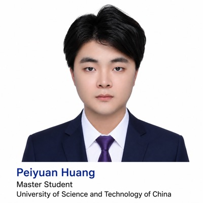

## 关于我

### **基本信息**

你好，我是 **Pei-Yuan Huang**。

我出生于2003年7月，是江西景德镇人。我目前在中国科学技术大学攻读硕士学位，实验室所属 **USTC-IAI-Quantum 量子人工智能实验室**，隶属合肥综合性国家科学中心人工智能研究院。

### **教育经历**

| 学校             | 学院                 | 学历                |
| :--------------- | -------------------- | ------------------- |
| 上海大学         | 计算机科学与工程学院 | 本科（2021 - 2025） |
| 中国科学技术大学 | 先进技术研究院       | 硕士（2025 - Now）  |

### **研究方向**

- 量子机器学习

- 量子线路搜索与优化

- AI for Science (AI4S)

## Blog

这个BlogSite主要记录以下几类内容：

- **大语言模型与智能体** — LLM-Agent相关的学习笔记，跟踪前沿进展与工程实践
- **科研进展** — 量子机器学习、AI4S 等领域的研究记录与论文笔记
- **课程学习** — 硕士期间课程内容的整理与总结
- **求职学习** — Leetcode刷题总结，八股文的相关整理

## 联系我

- GitHub: [PyHuangCs](https://github.com/PyHuangCs)
- 邮箱: [pyhuang@mail.ustc.edu.cn](mailto:pyhuang@mail.ustc.edu.cn)
